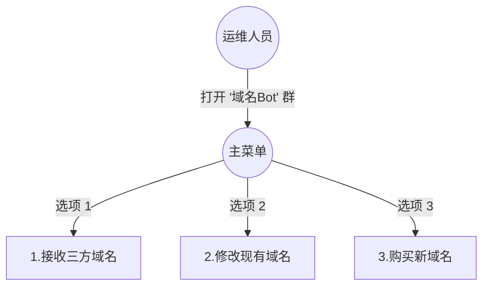
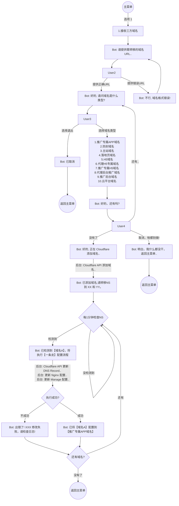
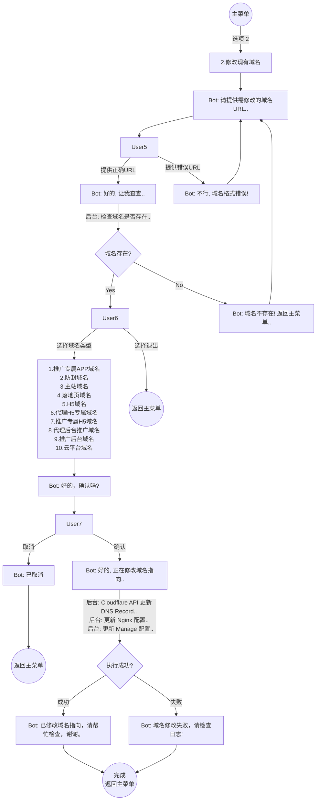
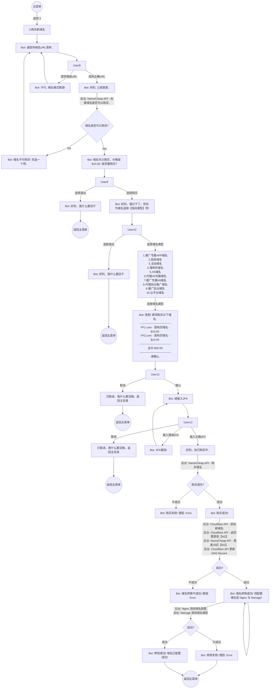

# 主菜单

```mermaid

flowchart TD

    User1((运维人员)) -->|打开 '域名Bot' 群| MainMenu((主菜单))
    MainMenu((主菜单)) -->|选项 1| Transfer_New_Domain[1.接收三方域名]
    MainMenu((主菜单)) -->|选项 2| Update_Existing_Domain[2.修改现有域名]
    MainMenu((主菜单)) -->|选项 3| Buy_New_Domain[3.购买新域名]

```

# 选项 1 - 接收三方域名

-
-
-

 选项 1 - 接收三方域名 - 交互逻辑图 
 

```mermaid

flowchart TD

    MainMenu((主菜单)) -->|选项 1| Transfer_New_Domain[1.接收三方域名]

    Transfer_New_Domain --> BotReply1[Bot: 请提供需转移的域名URL..] --> User2  
    User2 -->|提供正确URL| BotReply1_1[Bot: 好的, 请问域名是什么类型?] --> User3
    User2 -->|提供错误URL| BotReply1_2[Bot: 不行, 域名格式错误!] --> BotReply1

    User3 --> |选择域名类型| Option2[1.推广专属APP域名 <br> 2.防封域名 <br> 3.主站域名 <br> 4.落地页域名 <br> 5.H5域名 <br> 6.代理H5专属域名 <br> 7.推广专属H5域名 <br> 8.代理后台推广域名 <br> 9.推广后台域名 <br> 10.云平台域名]
    User3 --> |选择退出| BotReply1_1_2[Bot: 已取消] --> Back_To_Main1((返回主菜单))

    Option2 --> BotReply1_1_1[Bot: 好的，还有吗?] --> User4

    User4 -->|还有..| BotReply1_1
    User4 -->|没有了| BotReply1_1_1_1[Bot: 好的, 正在 Cloudflare 添加域名..] -->|后台: Cloudflare API 添加域名..| BotReply1_1_1_1_1[Bot: 已添加域名,请转移NS到 XX 和 YY。] 
    User4 -->|取消，啥都别做!| BotReply1_1_1_2[Bot: 明白，我什么都没干，返回主菜单..] --> Back_To_Main2((返回主菜单))

    BotReply1_1_1_1_1 --> AutoCheckDomainForNS{每1分钟检查NS} -->|没检测到| AutoCheckDomainForNS
    AutoCheckDomainForNS -->|检测到| BotReply1_1_1_1_1_1[Bot: 已检测到【域名A】，将执行【一条龙】配置流程]

    BotReply1_1_1_1_1_1 -->|后台: Cloudflare API 更新 DNS Record.. <br>后台: 更新 Nginx 配置.. <br> 后台: 更新 Manage 配置..| IsSuccess{执行成功?} -->|不成功| BotReply1_1_1_1_1_1_2[Bot: 出错了! XXX 修改失败，请检查日志!]

    IsSuccess -->|成功| BotReply1_1_1_1_1_1_1[Bot: 已将【域名A】配置到 【推广专属APP域名】]

    IsStillHavingDomainProcessing{还有域名?}
    BotReply1_1_1_1_1_1_2 --> IsStillHavingDomainProcessing
    BotReply1_1_1_1_1_1_1 --> IsStillHavingDomainProcessing
    IsStillHavingDomainProcessing -->|还有| AutoCheckDomainForNS
    IsStillHavingDomainProcessing -->|没有了| Back_To_Main3((返回主菜单))

```

-
-
-

# 选项 2 - 修改现有域名

-
-
-

 选项 2 - 修改现有域名 - 交互逻辑图  

```mermaid
flowchart TD

    MainMenu((主菜单)) -->|选项 2| Update_Existing_Domain[2.修改现有域名]

    Update_Existing_Domain --> BotReply2[Bot: 请提供需修改的域名URL..] --> User5
    User5 -->|提供正确URL| BotReply2_1[Bot: 好的, 让我查查..] -->|后台: 检查域名是否存在..| IsDomainExist{域名存在?}
    User5 -->|提供错误URL| BotReply2_2[Bot: 不行, 域名格式错误!] --> BotReply2

    IsDomainExist -->|Yes| User6
    IsDomainExist -->|No| BotReply2_3[Bot: 域名不存在! 返回主菜单..] --> BotReply2

    User6 --> |选择域名类型| Option3[1.推广专属APP域名 <br> 2.防封域名 <br> 3.主站域名 <br> 4.落地页域名 <br> 5.H5域名 <br> 6.代理H5专属域名 <br> 7.推广专属H5域名 <br> 8.代理后台推广域名 <br> 9.推广后台域名 <br> 10.云平台域名]
    User6 --> |选择退出| Back_To_Main5((返回主菜单))

    Option3 --> BotReply2_1_1[Bot: 好的，确认吗?] --> User7

    User7 -->|取消| BotReply2_1_1_2[Bot: 已取消] --> Back_To_Main6((返回主菜单))
    User7 -->|确认| BotReply2_1_1_1[Bot: 好的, 正在修改域名指向..] -->|后台: Cloudflare API 更新 DNS Record.. <br>后台: 更新 Nginx 配置.. <br> 后台: 更新 Manage 配置..| isSuccess2{执行成功?}

    isSuccess2 -->|成功| BotReply2_1_1_1_1[Bot: 已修改域名指向，请帮忙检查，谢谢。] --> Back_To_Main7((返回主菜单))
    isSuccess2 -->|失败| BotReply2_1_1_1_2[Bot: 域名修改失败，请检查日志!] --> Back_To_Main7((完成<br>返回主菜单))

```

-
-
-

# 选项 3 - 购买新域名

-
-
-

 选项 3 - 购买新域名 - 交互逻辑图 

```mermaid

flowchart TD

    MainMenu((主菜单)) -->|选项 3| Buy_New_Domain[3.购买新域名]

    Buy_New_Domain --> BotReply3[Bot: 请提供域名URL清单..] --> User8
    User8 --> | 提供正确URL | BotReply3_1[Bot: 好的, 让我查查..] -->|后台: NameCheap API - 检查域名是否可以购买..| IsDomainBuyable{域名是否可以购买?}
    User8 --> | 提供错误URL | BotReply3_2[Bot: 不行, 域名格式错误!] --> BotReply3

    IsDomainBuyable --> | No  | BotReply3_1_0[Bot: 域名不可购买! 另选一个吧..] --> BotReply3
    IsDomainBuyable --> | Yes | BotReply3_1_1[Bot: 域名可以购买，价格是 $10.00, 是否要购买?] --> User9

    User9 --> | 选择退出 | BotReply3_1_1_0[Bot: 好的，我什么都没干] --> Back_To_Main8((返回主菜单))
    User9 --> | 选择购买 | BotReply3_1_1_1[Bot: 好的，我记下了，您先为域名选择【指向类型】吧!] --> User10
    
    User10 --> | 选择退出    | BotReply3_1_1_1_0[Bot: 好的，我什么都没干] --> Back_To_Main9((返回主菜单))
    User10 --> | 选择域名类型 | Option4[1.推广专属APP域名 <br> 2.防封域名 <br> 3.主站域名 <br> 4.落地页域名 <br> 5.H5域名 <br> 6.代理H5专属域名 <br> 7.推广专属H5域名 <br> 8.代理后台推广域名 <br> 9.推广后台域名 <br> 10.云平台域名]

    Option4 --> | 选择域名类型 | BotReply3_1_1_1_1[Bot: 收到! 即将购买以下域名: <br>----------------------------------<br> FF1.com - 落地页域名 - $10.00 <br> FF2.com - 落地页域名 - $10.00 <br>----------------------------------<br> 总共 $20.00 <br>----------------------------------<br> 请确认..] --> User11

    User11 --> | 取消 | BotReply3_1_1_1_1_0[已取消，我什么都没做，返回主目录] --> Back_To_Main10((返回主菜单))
    User11 --> | 确认 | BotReply3_1_1_1_1_1[Bot: 请输入2FA] --> User12

    User12 --> | 取消        | BotReply3_1_1_1_1_1_0[已取消，我什么都没做，返回主目录] --> Back_To_Main11((返回主菜单))
    User12 --> | 输入错误2FA | BotReply3_1_1_1_1_1_2[Bot: 2FA错误!] --> BotReply3_1_1_1_1_1
    User12 --> | 输入正确2FA | BotReply3_1_1_1_1_1_1[好的，执行购买中..] --> |后台: NameCheap API - 购买域名| IsPurchaseSuccessful{购买成功?}

    IsPurchaseSuccessful --> | 不成功 | BotReply3_1_1_1_1_1_1_0[Bot: 购买失败! 原因: Error]
    IsPurchaseSuccessful --> | 成功   | BotReply3_1_1_1_1_1_1_1[Bot: 购买成功!] --> |后台: Cloudflare API - 添加新域名 <br> 后台: Cloudflare API - 返回需更改【NS】<br> 后台: NameCheap API - 更新对应【NS】 <br> 后台: Cloudflare API 更新 DNS Record <br> | IsDomainTransferSuccessful{成功?}

    IsDomainTransferSuccessful --> | 不成功 | BotReply3_1_1_1_1_1_1_1_0[Bot: 域名转移不成功! 原因: Error]
    IsDomainTransferSuccessful --> | 成功   | BotReply3_1_1_1_1_1_1_1_1[Bot: 域名转移成功! 将配置域名到 Nginx 与 Manage!] --> 

    BotReply3_1_1_1_1_1_1_1_1 --> | 后台: Nginx 添加域名配置 <br> 后台: Manage 添加域名类型 | IsNginxAndManageSuccessful{成功?}

    IsNginxAndManageSuccessful --> | 不成功 | BotReply3_1_1_1_1_1_1_1_1_0[Bot: 修改失败! 原因: Error] --> Back_To_Main12((返回主菜单))
    IsNginxAndManageSuccessful --> | 成功   | BotReply3_1_1_1_1_1_1_1_1_1[Bot: 修改成功! 域名已配置成功!] --> Back_To_Main12((返回主菜单))

```

-
-
-
